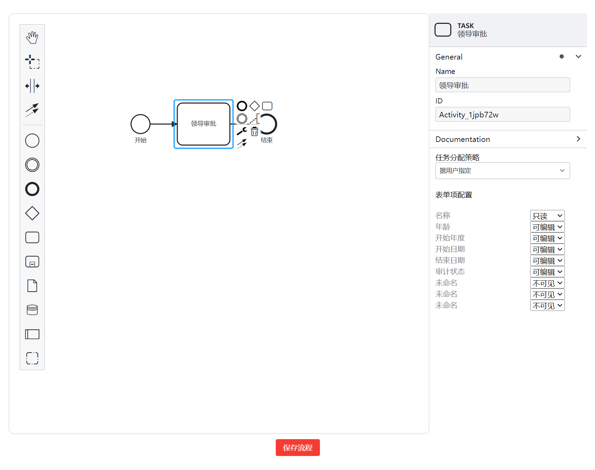

# 审计信息化平台 (Audit Information Platform - AIP) BPMN组件 示例

AIP-BPMN组件 示例，代码仓库：[GitHub](https://github.com/yonyouaudit/aip-bpmn-demo.git)

该模板由 `aip-toolkit` 工具前端项目的模板 [aip-toolkit](https://github.com/tufeiping/aip-toolkit) 生成。

## 引入组件

在 `package.json` 依赖中加入

~~~json
  "aip-bpmn": "latest",
~~~

然后执行

### `npm install`

安装依赖

### `npm run start`

启动调试环境

### `npm run build`

打包 `模型显示` 前端模块

## 依赖

- react 16.x
- tinper-bee 
- ref-multiple-table
- ref-tree
- aip-module
- aip-modelview
- aip-formengine

## 其他备注

> 北京用友审计软件有限公司  开发维护
